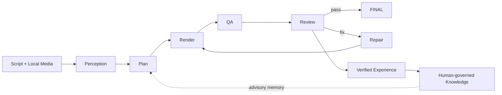

# Video OS

**A self-improving video production engine for AI agents.**

> **Public Beta v7.5** · Windows-first · Agent-neutral · Local-first production pipeline

[简体中文](README.zh-CN.md) · [Install](docs/INSTALL.md) · [Quickstart](docs/QUICKSTART.md) · [Architecture](docs/ARCHITECTURE.md) · [Perception](docs/PERCEPTION.md)

Video OS turns a script and local media into a deterministic edit plan and a validated vertical video. Coding agents operate it through one CLI; the Core does **not** depend on Codex, Claude Code, Gemini CLI, Hermes, or any other specific agent.



## Why Video OS

- **Agent-native:** `run`, `status`, `repair`, `feedback`, diagnostics, and redacted reports are available through one CLI.
- **Fail-closed production:** Perception, media decoding, QA, and signature-bound Review must be real before FINAL.
- **Self-repairing:** a Review `fix` verdict enters bounded Repair → re-render → QA → Review.
- **Verified learning:** only provenance-valid, production-verified evidence can enter the human-governed candidate/rule/activation chain. Memory remains advisory.
- **Replaceable Perception:** use Qwen API or the isolated Gemini Browser Worker without bypassing the Perception contract.

## Choose a Perception path

| Path | Best for | Browser required | Extra runtime |
| --- | --- | --- | --- |
| **Qwen API** | Fastest first setup, servers, headless use | No | API key |
| **Gemini Browser Worker** | Browser-based Perception without a Perception API integration | Chrome or Edge | Node.js + Playwright |

### Option A — Qwen API (recommended for the simplest first run)

```powershell
git clone https://github.com/VetaraWorks/video-production-os.git
cd video-production-os/produce-seeding-video

$env:QWEN_API_KEY="YOUR_KEY"
python scripts/video_os.py setup `
  --data-root "$env:LOCALAPPDATA\VideoOS" `
  --provider qwen-api `
  --model qwen3-vl-flash
python scripts/video_os.py doctor
```

### Option B — Gemini Browser Worker

```powershell
git clone https://github.com/VetaraWorks/video-production-os.git
cd video-production-os/produce-seeding-video

npm ci --ignore-scripts
python scripts/video_os.py setup `
  --data-root "$env:LOCALAPPDATA\VideoOS" `
  --provider gemini-worker
python scripts/video_os.py worker login
python scripts/video_os.py doctor
```

The Worker uses a dedicated browser profile. Video OS can discover Chrome or Microsoft Edge; it does not require Chrome specifically.

## Run your first project

Prepare a project with at least:

```text
project/
├── script/script.txt
└── raw_video/
```

Then let Video OS analyze and plan it:

```powershell
python scripts/video_os.py run C:\path\to\project --to PLAN
python scripts/video_os.py status C:\path\to\project
```

When an automatic Review Provider is configured, run the complete production chain:

```powershell
python scripts/video_os.py run C:\path\to\project --to FINAL
```

If Review is unavailable, Video OS **fails closed** instead of pretending the project reached FINAL.

Input media stays immutable. Generated artifacts are written under the project `output/`, while user configuration, Knowledge, Worker profile, caches, and logs live under the selected data root.

## Agent control surface

Agents should call the public CLI instead of importing internal modules or hand-editing state:

```text
setup · doctor · run · status · repair · feedback · report · worker
```

See [AGENTS.md](AGENTS.md) for the operating contract and safety boundaries.

## Feedback during Public Beta

Found a failure or quality problem? Use the repository Issue templates for bugs, compatibility reports, and output-quality feedback. For diagnostics, generate a redacted report first:

```powershell
python scripts/video_os.py report C:\path\to\project
```

Do not attach private media, cookies, browser profiles, credentials, or API keys to a public issue.

## License

Video OS is licensed under the [GNU Affero General Public License v3.0 or later](LICENSE) (`AGPL-3.0-or-later`). Third-party components remain under their respective licenses; see [third-party notices](produce-seeding-video/THIRD_PARTY_NOTICES.md).
