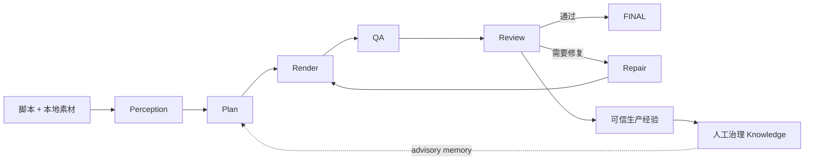

# Video OS

**面向 AI Agent 的自改进视频生产引擎。**

> **Public Beta v7.5** · Windows 优先 · Agent 中立 · 本地优先的视频生产流水线

[English](README.md) · [安装](docs/INSTALL.md) · [快速开始](docs/QUICKSTART.md) · [架构](docs/ARCHITECTURE.md) · [视频理解](docs/PERCEPTION.md)

Video OS 将脚本和本地素材转化为确定性剪辑计划与经过真实验证的竖屏视频。Codex、Claude Code、Gemini CLI、Hermes 等 Agent 都通过统一 CLI 调用，Core **不依赖任何特定 Agent**。



## 为什么是 Video OS

- **Agent 原生：** 一个 CLI 覆盖 `run`、`status`、`repair`、`feedback`、诊断和脱敏报告。
- **失败关闭：** 真实 Perception、媒体解码、QA 与绑定当前视频签名的 Review 全部成立后才允许 FINAL。
- **自动修复闭环：** Review 返回 `fix` 后进入有限重试的 Repair → 重新 Render → QA → Review。
- **可信学习：** 只有来源有效、经过生产验证的 Evidence 才能进入人工治理的候选规则 / 审核 / 激活链；Memory 仍为 advisory。
- **可替换 Perception：** 可使用 Qwen API 或独立 Gemini Browser Worker，二者都不能绕过现有 Perception 合约。

## 选择视频理解方式

| 方案 | 更适合 | 是否需要浏览器 | 额外依赖 |
| --- | --- | --- | --- |
| **Qwen API** | 最快跑通、服务器、无头环境 | 否 | API Key |
| **Gemini Browser Worker** | 通过浏览器完成 Perception | Chrome 或 Edge | Node.js + Playwright |

### 方案 A — Qwen API（推荐首次使用）

```powershell
git clone https://github.com/VetaraWorks/video-production-os.git
cd video-production-os/produce-seeding-video

$env:QWEN_API_KEY="YOUR_KEY"
python scripts/video_os.py setup `
  --data-root "$env:LOCALAPPDATA\VideoOS" `
  --provider qwen-api `
  --model qwen3-vl-flash
python scripts/video_os.py doctor
```

### 方案 B — Gemini Browser Worker

```powershell
git clone https://github.com/VetaraWorks/video-production-os.git
cd video-production-os/produce-seeding-video

npm ci --ignore-scripts
python scripts/video_os.py setup `
  --data-root "$env:LOCALAPPDATA\VideoOS" `
  --provider gemini-worker
python scripts/video_os.py worker login
python scripts/video_os.py doctor
```

Worker 使用独立浏览器 Profile。Video OS 可以自动发现 Chrome 或 Microsoft Edge，并不强制要求 Chrome。

## 跑第一个项目

至少准备：

```text
project/
├── script/script.txt
└── raw_video/
```

先让 Video OS 完成理解与规划：

```powershell
python scripts/video_os.py run C:\你的项目 --to PLAN
python scripts/video_os.py status C:\你的项目
```

配置好自动 Review Provider 后，再跑完整生产链：

```powershell
python scripts/video_os.py run C:\你的项目 --to FINAL
```

如果 Review Provider 不可用，Video OS 会**失败关闭**，不会假装项目已经进入 FINAL。

输入素材保持只读不变。生成产物写入项目的 `output/`；用户配置、Knowledge、Worker Profile、缓存和日志位于所选 data root。

## Agent 控制入口

Agent 应调用公开 CLI，不要直接 import 内部模块，也不要手改状态：

```text
setup · doctor · run · status · repair · feedback · report · worker
```

详细边界见 [AGENTS.md](AGENTS.md)。

## Public Beta 反馈

遇到 Bug、兼容性问题或成片质量问题，可以直接使用仓库中的 Issue 模板。提交问题前建议先生成脱敏报告：

```powershell
python scripts/video_os.py report C:\你的项目
```

不要在公开 Issue 中上传私人素材、Cookie、浏览器 Profile、凭据或 API Key。

## License

Video OS 采用 [GNU Affero General Public License v3.0 or later](LICENSE)（`AGPL-3.0-or-later`）许可。第三方组件继续适用各自许可证；详见 [THIRD_PARTY_NOTICES.md](produce-seeding-video/THIRD_PARTY_NOTICES.md)。
